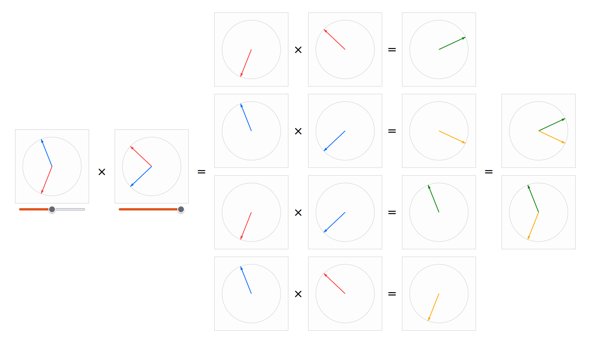

# math visualizations

Prototypes of [javascript animations](https://christophwald.github.io/math_visualizations/) for basic signal processing/audio synthesis math. When finished, these can be used as interactive tools for teaching or as part of a written introduction.

The initial motivation was to find a visualization for the fact that the multiplication of two sinusoids of frequencies f1 and f2 leads to two sinusoids with frequencies f1+f2 and f1-f2. The animation should built a path for understanding. 

Next step: unify visuals, write explanations

More ideas to visualize: Sampling, FFT and Convolution, Subtractive Synthesis (Filter), Modulational Synthesis (FM/PM), Nonlinear Synthesis (Waveshaping)

